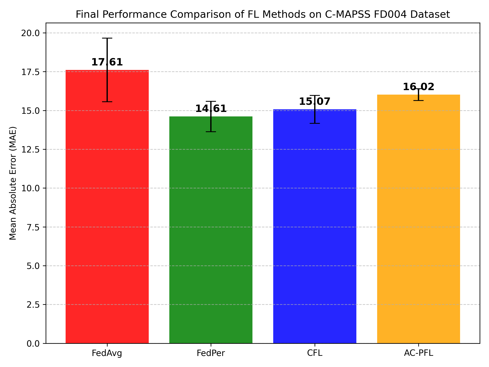
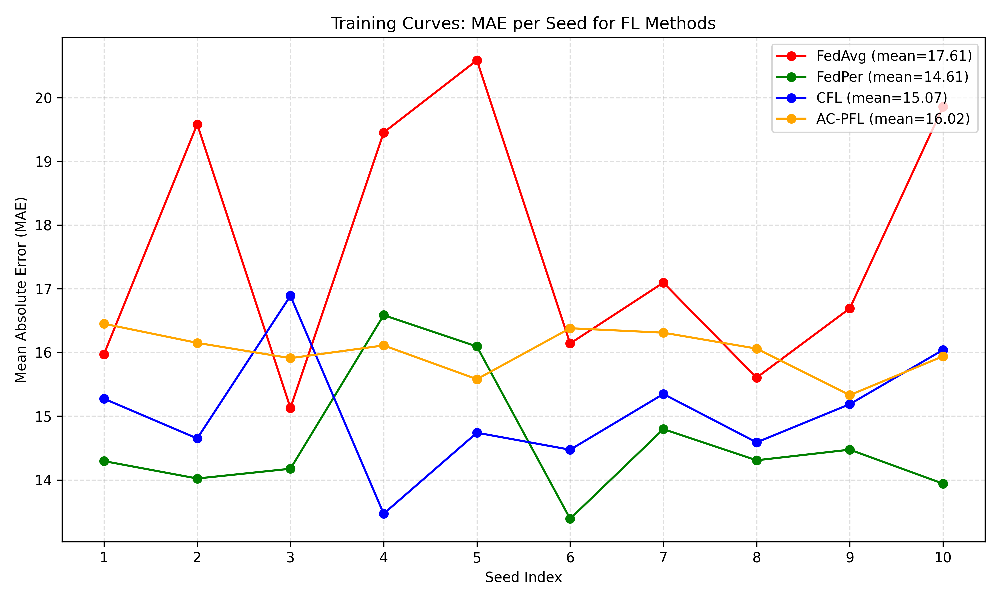
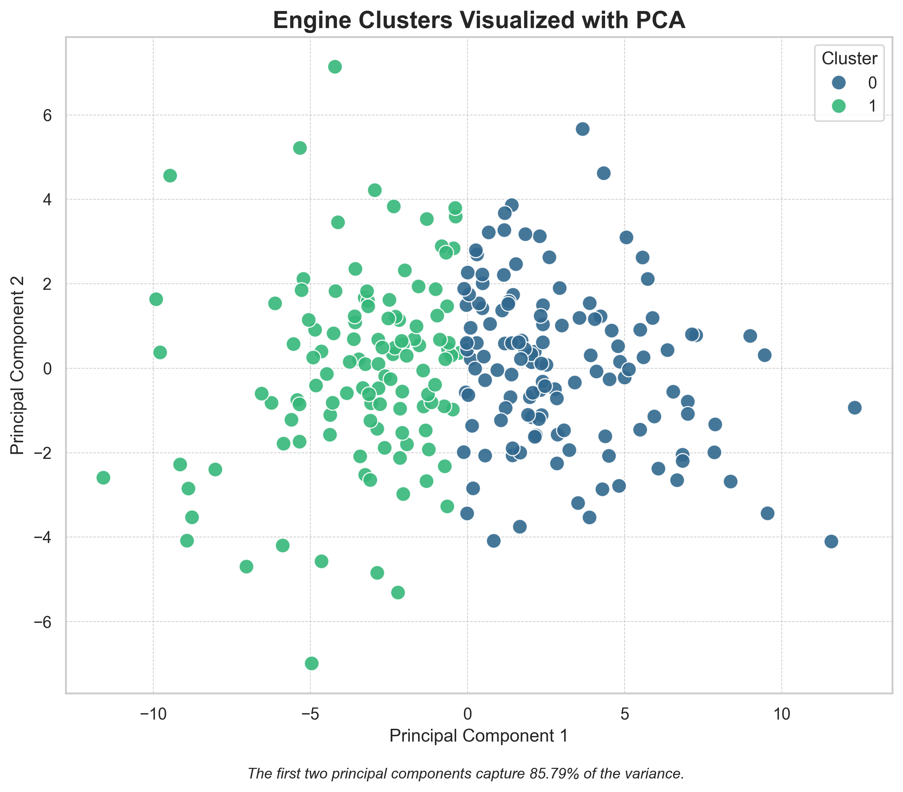

# AC-PFL: Adaptive Clustered Personalized Federated Learning

**Conference Paper Accepted at [CONFERENCE NAME]** | [Add conference name/link when available]

Novel federated learning framework achieving **81.5% lower prediction variance** than baseline FL for NASA turbofan engine RUL prediction in non-IID environments.

## Key Results





| Method | MAE (cycles) | Std Dev | Rank |
|--------|--------------|---------|------|
| **FedPer** | 14.61 | ±0.98 | 1st |
| **CFL** | 15.07 | ±0.90 | 2nd |
| **AC-PFL (Ours)** | **16.02** | **±0.38** | 3rd |
| **FedAvg** | 17.61 | ±2.05 | 4th |

**Why AC-PFL matters for safety-critical systems:**
- **81.5% lower variance** than FedAvg (±0.38 vs ±2.05 cycles)
- Most **consistent predictions** across experimental runs
- Only **4.9% worst-case degradation** from mean (vs 13.6% for FedPer)
- Enables **tighter maintenance windows** with ±0.76 cycle buffer vs ±1.96 for FedPer

## Innovation

AC-PFL combines **static degradation-aware clustering** with **client-level personalization**:
1. Pre-training clustering groups engines by sensor degradation patterns (K-means, k=2)
2. Cluster-wise federated training shares feature extractors within groups
3. Client-specific prediction heads enable local adaptation

This hybrid approach trades 9.6% accuracy for **2.4× more stable predictions** - optimal for industrial deployments where reliability is paramount.

## Implemented Algorithms

All methods use consistent LSTM architectures for fair comparison:

- **`main_fedavg.py`** - Standard federated averaging (baseline)
- **`main_fedper.py`** - Personalized FL with private prediction heads
- **`main_cfl.py`** - Dynamic clustered FL based on gradient similarity
- **`main_acpfl.py`** - Our adaptive clustered approach with personalization ⭐

## Dataset

**NASA C-MAPSS FD004** - Most challenging turbofan degradation subset:
- 249 engines across 6 operating conditions
- 2 distinct fault modes (HPC & Fan degradation)
- 21 sensor readings + 3 operational settings
- Realistic non-IID environment

## Experimental Setup

- **Communication Rounds:** 15
- **Clients per Round:** 20 (balanced across clusters)
- **Local Training:** Up to 20 epochs with early stopping (patience=3)
- **Statistical Validation:** 10 random seeds
- **Architecture:** 2-layer LSTM (64→32 units) + personalized dense heads

## Quick Start
```bash
# Install dependencies
pip install -r requirements.txt

# Preprocess data
python preprocess.py

# Run experiments
python main_acpfl.py    # Our method
python main_fedavg.py   # Baseline
python main_fedper.py   # Best accuracy
python main_cfl.py      # Dynamic clustering

# Visualize clusters
python visualize_clusters.py
```

## Tech Stack

`PyTorch` `Federated Learning` `LSTM` `K-Means Clustering` `NASA C-MAPSS` `Predictive Maintenance`

## Citation
```
Fardin Kaiser, "Adaptive Clustered Personalized Federated Learning for Non-IID 
Remaining Useful Life Prediction in Edge-Based Industrial Systems," 
[Conference Name], 2025 (accepted, publication pending).
```

## Paper

📄 Full paper: [https://ieeexplore.ieee.org/document/11491433]

## Key Findings

1. **Accuracy vs Consistency Tradeoff:** FedPer achieves best accuracy (14.61 MAE) but 2.1× higher variance than AC-PFL
2. **Static vs Dynamic Clustering:** CFL's adaptability costs 6.3% accuracy vs AC-PFL but gains data diversity
3. **Worst-Case Analysis:** AC-PFL's worst-case performance (16.8 cycles) nearly matches CFL (16.9) despite higher mean
4. **Industrial Impact:** AC-PFL enables 2.4% more operational runtime through tighter safety buffers

---

**For industrial practitioners:** Choose FedPer for average-case optimization, AC-PFL for worst-case risk minimization in safety-critical systems, CFL when data distributions evolve over time.
